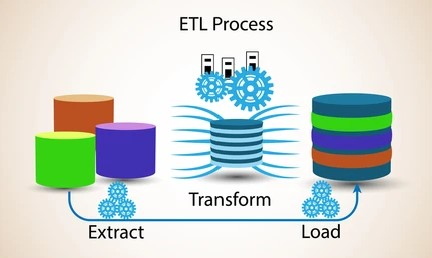
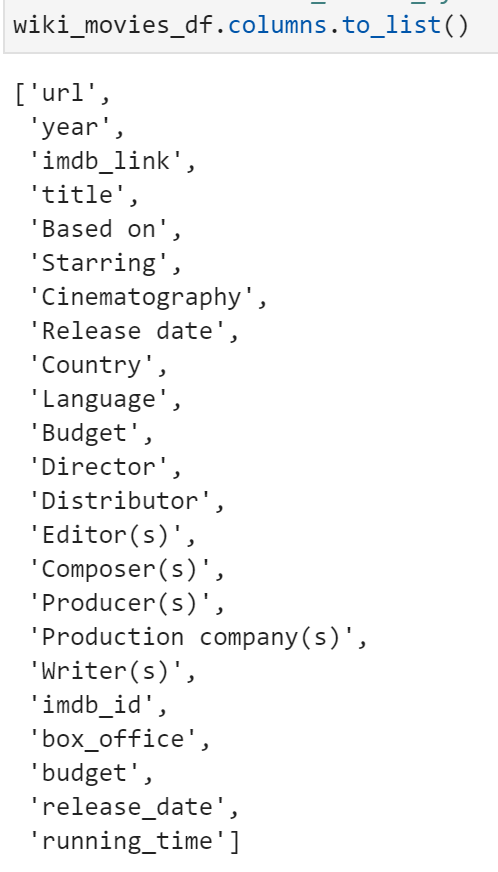
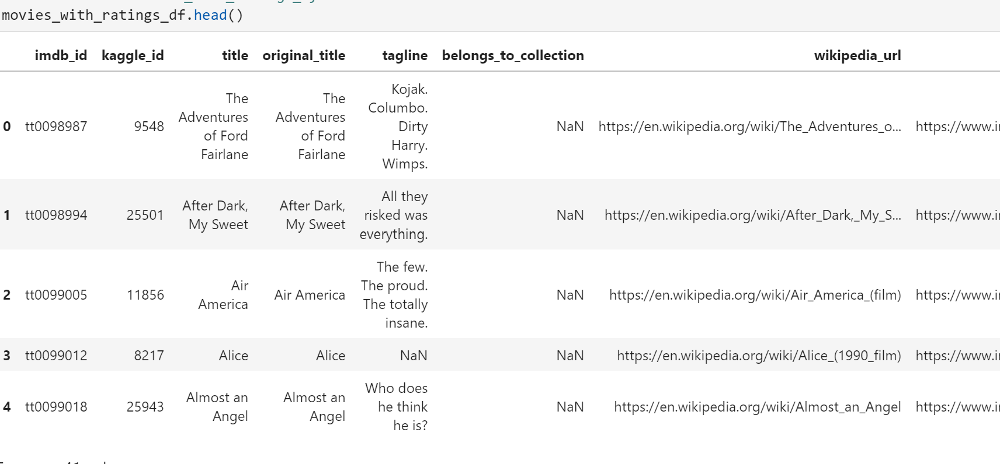
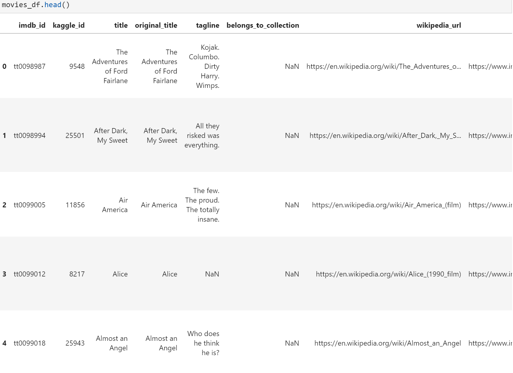
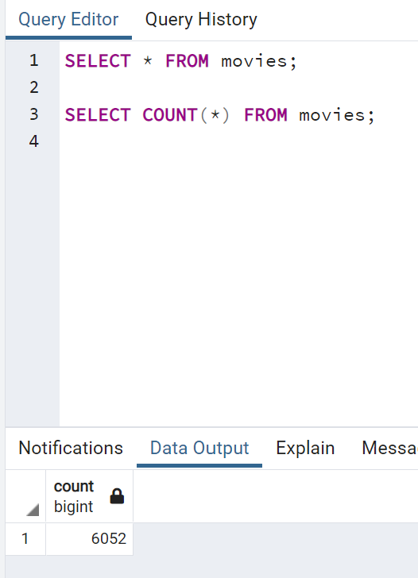
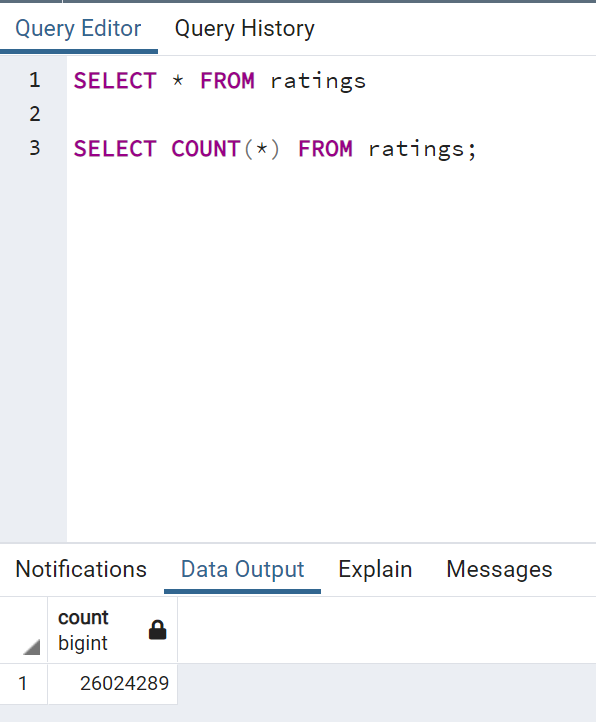
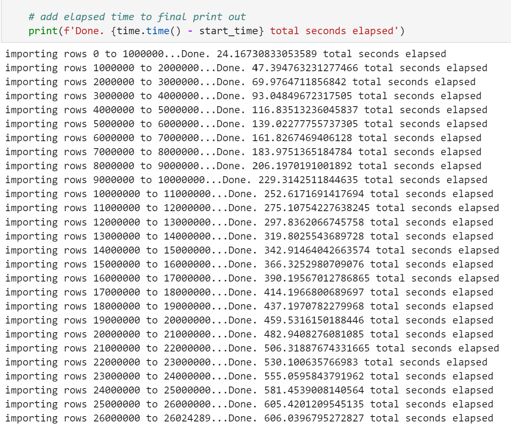

# Movies-ETL
Developing an algorithm for Amazing Prime videos for the prediction of low budget popular movies for streaming online.

## Overview of the Project :
Amazing Prime videos is a platform for streaming movies and TV shows on Amazing Prime, the world's largest online retailer. This analysis is done to help the Amaziing prime video team to predict which low budget movies have the probability of becoming popular so that they can list these movies for purchasing their streaming rights at a bargain. Amazing Prime has decided to sponsor a hackathon, providing a clean data set of movie data and asking participants to predict the popular movies. Hence the dataset is created to source data from two data sources : 1. a scrape of wikipedia for all movies released since 1990 and roting data from the Movie Land's website.

In this project we have create an automated pipeline that takes in new data, performs the appropriate transformations, and loads the data into existing tables.

We have created one function that takes in the three files—Wikipedia data, Kaggle metadata, and the MovieLens rating data—and performs the ETL process by adding the data to a PostgreSQL database.

## Tools used : 

In this analysis we have extracted the data from the above two sources, transform it into one clean data set, and finally load that data set into a SQL table. 

## Results :
## Deliverable 1: Write an ETL Function to Read Three Data Files

Following steps are done in order to write an ETL function :
1. An ETL function is written to read in the three data files.

2. The function converts the Wikipedia JSON file to a Pandas DataFrame, and the DataFrame is displayed in the ETL_function_test.ipynb file.

3. ​The function converts the Kaggle metadata file to a Pandas DataFrame, and the DataFrame is displayed in the ETL_function_test.ipynb file.

4. ​The function converts the MovieLens ratings data file to a Pandas DataFrame, and the DataFrame is displayed in the ETL_function_test.ipynb file.

## Deliverable 2: Extract and Transform the Wikipedia Data

Folloing steps are taken in order to further extract and transform the wikipedia data :

1. The TV shows are filtered out, and the wiki_movies_df DataFrame is created.

2. A try-except block is used to catch errors while extracting the IMDb IDs with a regular expression and dropping duplicate IDs.

3. The extraction and transformation of the Wikipedia data in the ETL function does the following:
    a. A list comprehension is used to keep columns with non-null values.

    b. The non-null box office data is converted to string values using the lambda and join functions.

    c. A regular expression is used to match the six elements of "form_one" of the box office data.

    d. A regular expression is used to match the three elements of "form_two" of the box office data.

The following columns are cleaned in the Wikipedia DataFrame: (8 pt)
The box office column
The budget column
The release date column
The running time column
​
4. The cleaned Wikipedia data is converted to a Pandas DataFrame, and the DataFrame is displayed in the ETL_clean_wiki_movies.ipynb file.

## Deliverable 3: Extract and Transform the Kaggle Data

The extraction and transformation of the Kaggle metadata using the ETL function does the following:

1. The Kaggle metadata is cleaned.

2. The Wikipedia and Kaggle DataFrames are merged.

3. The following is performed on the merged Wikipedia and Kaggle DataFrames to create the movies_df:
    a. Unnecessary columns are dropped.

    b. A function is used to fill in the missing Kaggle data.

    c. The movies_df DataFrame is filtered to keep specific columns.

    d. The movies_df DataFrame columns are renamed.
    !

4. The extraction and transformation of the MovieLens ratings data using the ETL function does the following:

    a. The ratings counts are cleaned.

    b. The movies_df DataFrame is merged with the cleaned ratings DataFrame to create the movies_with_ratings_df DataFrame.

    c. The empty values in the movies_with_ratings_df DataFrame are filled with “0”.

5. The movies_with_ratings_df and the movies_df DataFrames are displayed in the ETL_clean_kaggle_data.ipynb file

## Deliverable 4: Create the Movie Database

1. The data from the movies_df DataFrame replaces the current data in the movies table in the SQL database, as determined by the movies_query.png. We see that we finally have 6052 rows of data in the table movies.

2. The data from the MovieLens rating CSV file is added to the ratings table in the SQL database, as determined by the ratings_query.png.

3. The elapsed time to add the data to the database is displayed in the ETL_create_database.ipynb file.

## Summary :
We were successfully able to extract, transform and load the data files making it easier for further analysis by the hackathon team.
